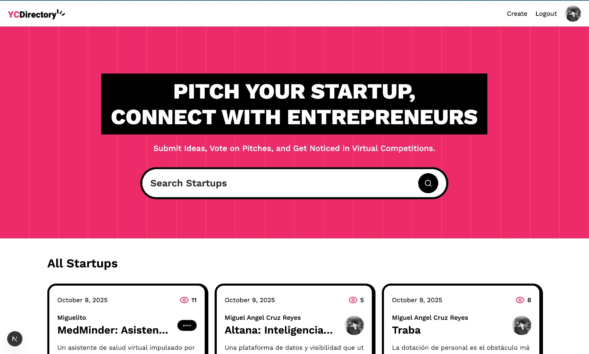

# 🚀 YCDirectory - Directorio de Startups

<div align="center">

**Un directorio de startups moderno y de alto rendimiento, construido con las últimas tecnologías para ofrecer una experiencia de usuario excepcional.**

</div>

<p align="center">
  
  
  
  
  
</p>

<div align="center">
  
</div>


## ✨ Características Principales

<div style="
  display: grid;
  grid-template-columns: repeat(auto-fit, minmax(300px, 1fr));
  gap: 1.5rem;
  margin: 2rem 0;
">
  <!-- Tarjeta 1 -->
  <div style="
    background: linear-gradient(145deg, #f8fafc, #f1f5f9);
    border-radius: 12px;
    padding: 1.5rem;
    box-shadow: 0 4px 6px -1px rgba(0, 0, 0, 0.1), 0 2px 4px -1px rgba(0, 0, 0, 0.06);
    transition: transform 0.3s ease, box-shadow 0.3s ease;
    border-left: 4px solid #3b82f6;
  ">
    <h3 style="
      color: #1e293b;
      font-size: 1.1rem;
      font-weight: 600;
      margin: 0 0 0.75rem 0;
      display: flex;
      align-items: center;
      gap: 0.5rem;
    ">
      <span style="font-size: 1.5rem;">📱</span> Interfaz Moderna
    </h3>
    <p style="
      color: #475569;
      line-height: 1.6;
      margin: 0;
      font-size: 0.95rem;
    ">Experiencia de usuario impecable en cualquier dispositivo, desde móviles hasta escritorios.</p>
  </div>

  <!-- Tarjeta 2 -->
  <div style="
    background: linear-gradient(145deg, #f8fafc, #f1f5f9);
    border-radius: 12px;
    padding: 1.5rem;
    box-shadow: 0 4px 6px -1px rgba(0, 0, 0, 0.1), 0 2px 4px -1px rgba(0, 0, 0, 0.06);
    transition: transform 0.3s ease, box-shadow 0.3s ease;
    border-left: 4px solid #10b981;
  ">
    <h3 style="
      color: #1e293b;
      font-size: 1.1rem;
      font-weight: 600;
      margin: 0 0 0.75rem 0;
      display: flex;
      align-items: center;
      gap: 0.5rem;
    ">
      <span style="font-size: 1.5rem;">⚡</span> Rendimiento
    </h3>
    <p style="
      color: #475569;
      line-height: 1.6;
      margin: 0;
      font-size: 0.95rem;
    ">Cargas casi instantáneas gracias a Next.js 14 con Server Side Rendering (SSR) y Static Site Generation (SSG).</p>
  </div>

  <!-- Tarjeta 3 -->
  <div style="
    background: linear-gradient(145deg, #f8fafc, #f1f5f9);
    border-radius: 12px;
    padding: 1.5rem;
    box-shadow: 0 4px 6px -1px rgba(0, 0, 0, 0.1), 0 2px 4px -1px rgba(0, 0, 0, 0.06);
    transition: transform 0.3s ease, box-shadow 0.3s ease;
    border-left: 4px solid #8b5cf6;
  ">
    <h3 style="
      color: #1e293b;
      font-size: 1.1rem;
      font-weight: 600;
      margin: 0 0 0.75rem 0;
      display: flex;
      align-items: center;
      gap: 0.5rem;
    ">
      <span style="font-size: 1.5rem;">🔍</span> Búsqueda Avanzada
    </h3>
    <p style="
      color: #475569;
      line-height: 1.6;
      margin: 0;
      font-size: 0.95rem;
    ">Encuentra startups por nombre, sector, tecnologías o ubicación de forma rápida y precisa.</p>
  </div>

  <!-- Tarjeta 4 -->
  <div style="
    background: linear-gradient(145deg, #f8fafc, #f1f5f9);
    border-radius: 12px;
    padding: 1.5rem;
    box-shadow: 0 4px 6px -1px rgba(0, 0, 0, 0.1), 0 2px 4px -1px rgba(0, 0, 0, 0.06);
    transition: transform 0.3s ease, box-shadow 0.3s ease;
    border-left: 4px solid #ec4899;
  ">
    <h3 style="
      color: #1e293b;
      font-size: 1.1rem;
      font-weight: 600;
      margin: 0 0 0.75rem 0;
      display: flex;
      align-items: center;
      gap: 0.5rem;
    ">
      <span style="font-size: 1.5rem;">🔄</span> Contenido Dinámico
    </h3>
    <p style="
      color: #475569;
      line-height: 1.6;
      margin: 0;
      font-size: 0.95rem;
    ">Gestión de datos en tiempo real a través del headless CMS Sanity.io.</p>
  </div>

  <!-- Tarjeta 5 -->
  <div style="
    background: linear-gradient(145deg, #f8fafc, #f1f5f9);
    border-radius: 12px;
    padding: 1.5rem;
    box-shadow: 0 4px 6px -1px rgba(0, 0, 0, 0.1), 0 2px 4px -1px rgba(0, 0, 0, 0.06);
    transition: transform 0.3s ease, box-shadow 0.3s ease;
    border-left: 4px solid #f59e0b;
  ">
    <h3 style="
      color: #1e293b;
      font-size: 1.1rem;
      font-weight: 600;
      margin: 0 0 0.75rem 0;
      display: flex;
      align-items: center;
      gap: 0.5rem;
    ">
      <span style="font-size: 1.5rem;">🔐</span> Autenticación Segura
    </h3>
    <p style="
      color: #475569;
      line-height: 1.6;
      margin: 0;
      font-size: 0.95rem;
    ">Sistema de registro e inicio de sesión robusto y seguro implementado con NextAuth.js.</p>
  </div>

  <!-- Tarjeta 6 -->
  <div style="
    background: linear-gradient(145deg, #f8fafc, #f1f5f9);
    border-radius: 12px;
    padding: 1.5rem;
    box-shadow: 0 4px 6px -1px rgba(0, 0, 0, 0.1), 0 2px 4px -1px rgba(0, 0, 0, 0.06);
    transition: transform 0.3s ease, box-shadow 0.3s ease;
    border-left: 4px solid #ef4444;
  ">
    <h3 style="
      color: #1e293b;
      font-size: 1.1rem;
      font-weight: 600;
      margin: 0 0 0.75rem 0;
      display: flex;
      align-items: center;
      gap: 0.5rem;
    ">
      <span style="font-size: 1.5rem;">📊</span> Monitorización
    </h3>
    <p style="
      color: #475569;
      line-height: 1.6;
      margin: 0;
      font-size: 0.95rem;
    ">Integración con Sentry para la detección y resolución proactiva de problemas.</p>
  </div>

  <!-- Tarjeta 7 -->
  <div style="
    background: linear-gradient(145deg, #f8fafc, #f1f5f9);
    border-radius: 12px;
    padding: 1.5rem;
    box-shadow: 0 4px 6px -1px rgba(0, 0, 0, 0.1), 0 2px 4px -1px rgba(0, 0, 0, 0.06);
    transition: transform 0.3s ease, box-shadow 0.3s ease;
    border-left: 4px solid #6366f1;
  ">
    <h3 style="
      color: #1e293b;
      font-size: 1.1rem;
      font-weight: 600;
      margin: 0 0 0.75rem 0;
      display: flex;
      align-items: center;
      gap: 0.5rem;
    ">
      <span style="font-size: 1.5rem;">🎨</span> Componentes Reutilizables
    </h3>
    <p style="
      color: #475569;
      line-height: 1.6;
      margin: 0;
      font-size: 0.95rem;
    ">UI construida con Shadcn/ui, garantizando accesibilidad y consistencia en todos los componentes.</p>
  </div>
</div>

<style>
  /* Efecto hover para las tarjetas */
  @media (hover: hover) {
    div[style*="background: linear-gradient"]:hover {
      transform: translateY(-4px);
      box-shadow: 0 10px 15px -3px rgba(0, 0, 0, 0.1), 0 4px 6px -2px rgba(0, 0, 0, 0.05);
    }
  }
</style>

## 🛠️ Stack Tecnológico

Este proyecto integra un conjunto de tecnologías modernas para garantizar escalabilidad, rendimiento y una excelente experiencia de desarrollo.

### Frontend
| Tecnología | Descripción |
| :--- | :--- |
| **Next.js 14** | Framework de React para producción con renderizado híbrido. |
| **TypeScript** | Superset de JavaScript con tipado estático para un código más robusto. |
| **Tailwind CSS** | Framework CSS utility-first para un diseño rápido y personalizable. |
| **Shadcn/ui** | Componentes de UI accesibles y componibles. |
| **React Hook Form** | Manejo de formularios performante y flexible. |
| **Zod** | Validación de esquemas para TypeScript. |
| **Framer Motion** | Biblioteca para crear animaciones fluidas y complejas. |

### Backend y Datos
| Tecnología | Descripción |
| :--- | :--- |
| **Next.js API Routes** | Creación de endpoints de API serverless. |
| **NextAuth.js** | Solución completa de autenticación para Next.js. |
| **Sanity.io** | Headless CMS para la gestión de contenido estructurado. |
| **MongoDB** | Base de datos NoSQL utilizada como almacenamiento principal. |

### Herramientas de Desarrollo y DevOps
| Herramienta | Descripción |
| :--- | :--- |
| **ESLint** | Linter para identificar y corregir problemas en el código. |
| **Prettier** | Formateador de código para mantener un estilo consistente. |
| **Husky & Commitlint** | Git hooks para automatizar la calidad y el formato de los commits. |
| **Sentry** | Monitorización de errores y rendimiento en tiempo real. |
| **Vercel** | Plataforma de despliegue continuo y hosting optimizada para Next.js. |

## 🚀 Cómo Empezar

Sigue estos pasos para configurar y ejecutar el proyecto en tu entorno local.

### Requisitos Previos

- **Node.js**: Versión 18.17 o superior.
- **npm** o **yarn**: Gestor de paquetes.
- **Cuenta en Sanity.io**: Para gestionar el contenido del directorio.
- **Base de datos MongoDB**: Puedes usar una instancia local o en la nube (MongoDB Atlas).

### Instalación

1.  **Clona el repositorio:**
    ```bash
    git clone [https://github.com/tu-usuario/YCDirectory.git](https://github.com/tu-usuario/YCDirectory.git)
    cd YCDirectory
    ```

2.  **Instala las dependencias:**
    ```bash
    npm install
    # o
    yarn install
    ```

3.  **Configura las variables de entorno:**
    Crea un archivo `.env.local` en la raíz del proyecto y añade las siguientes variables. Puedes usar `.env.example` como plantilla.
    ```env
    # MongoDB
    MONGODB_URI=tu_uri_de_mongodb

    # NextAuth
    NEXTAUTH_SECRET=genera_un_secret_aqui
    NEXTAUTH_URL=http://localhost:3000
    GITHUB_ID=tu_github_client_id
    GITHUB_SECRET=tu_github_client_secret

    # Sanity.io
    SANITY_API_TOKEN=tu_token_de_sanity
    NEXT_PUBLIC_SANITY_PROJECT_ID=tu_project_id_de_sanity
    NEXT_PUBLIC_SANITY_DATASET=production

    # Sentry
    SENTRY_DSN=tu_dsn_de_sentry
    ```

4.  **Ejecuta el proyecto:**
    ```bash
    npm run dev
    # o
    yarn dev
    ```

¡Abre [http://localhost:3000](http://localhost:3000) en tu navegador para ver la aplicación en funcionamiento!

